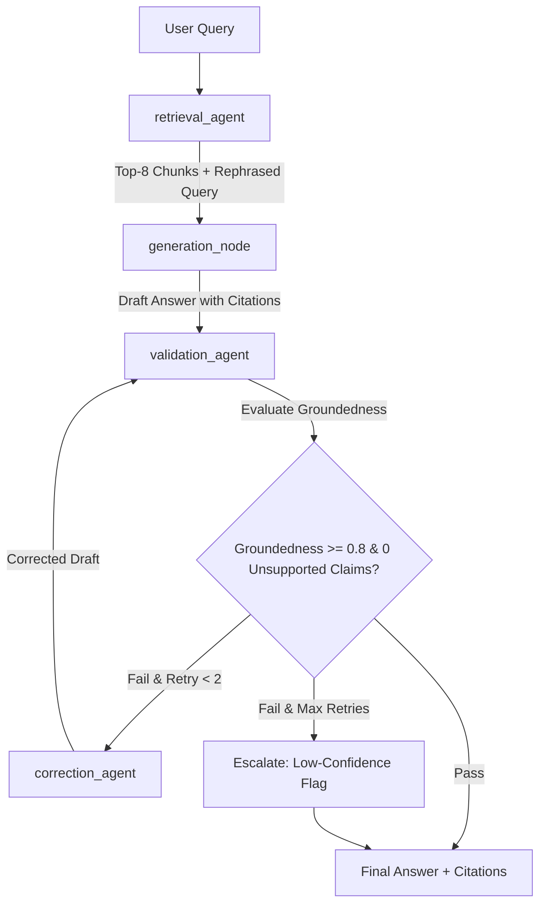

# 🛡️ DocRAG: Self-Healing Multi-Agent RAG Chatbot

[](https://fastapi.tiangolo.com/)
[](https://github.com/langchain-ai/langgraph)
[](https://qdrant.tech/)
[](https://reactjs.org/)
[](LICENSE)

**DocRAG** is an enterprise-grade, self-healing multi-agent Retrieval-Augmented Generation (RAG) system designed specifically for internal engineering documentation. Built on **FastAPI**, **LangGraph**, **Qdrant**, **PostgreSQL**, and **React + TypeScript**, DocRAG automatically validates LLM responses against grounded context, detecting unsupported claims and triggering correction loops before answering developer queries.

---

## 🚀 Key Features

- **🧠 Self-Healing Multi-Agent Graph**: Powered by LangGraph with 4 autonomous agent nodes:
  - `retrieval_agent`: Rewrites follow-up queries using chat history and performs hybrid top-8 vector search.
  - `generation_node`: Drafts context-grounded responses requiring strict inline citations (`[Source: file#heading]`).
  - `validation_agent`: Evaluates draft answers using structured output for groundedness scores ($\ge 0.8$) and unsupported claims.
  - `correction_agent`: Removes flagged ungrounded statements and rewrites answers (up to 2 retries).
- **📊 Real-Time Agent Trace View**: Interactive collapsible UI panel displaying node execution steps, groundedness scores, flagged issues, and low-confidence escalation warnings.
- **⚡ Dual Inference Architecture**: Supports **vLLM** (`Qwen3-8B-Instruct`) for production GPU inference, alongside an instant CPU **Mock LLM fallback** mode for offline local development without GPU requirements.
- **🔍 Clickable Citation Inspector**: Inline source tags link directly to expandable modal views of raw context chunks.
- **📈 Comprehensive Eval Harness**: Built-in benchmark harness (`run_eval.py`) evaluating groundedness score, accuracy, correction trigger rates, and latency against sample engineering docs.
- **📦 Enterprise Cloud & K8s Ready**: Includes Docker Compose local orchestration, Vercel frontend deployment integration, and complete Kubernetes Helm charts with HPA autoscaling & Grafana dashboard metrics.

---

## 🏗️ Architecture Overview



---

## 💻 Tech Stack

- **Backend**: Python 3.11, FastAPI, LangGraph, SQLAlchemy (Async), Alembic
- **Vector DB**: Qdrant (1024-dim Cosine similarity with `BAAI/bge-large-en-v1.5` embeddings)
- **Relational DB**: PostgreSQL (Chat sessions, message history, and agent node execution traces)
- **Cache**: Redis (Session state management)
- **Frontend**: React 18, Vite, TypeScript, Tailwind CSS, Lucide Icons
- **Local Orchestration**: Docker Compose
- **Production Infrastructure**: Helm v3 (Kubernetes / RKE2), Prometheus ServiceMonitor, Grafana Dashboard

---

## ⚙️ Quick Start (End-to-End Local Setup)

### Prerequisites
- [Docker Desktop / Colima](https://www.docker.com/)
- [Python 3.11+](https://www.python.org/)
- [Node.js 18+](https://nodejs.org/)

---

### Step 1: Clone Repository & Environment Setup

```bash
git clone https://github.com/YOUR_USERNAME/DocRAG.git
cd DocRAG

# Copy environment template
cp .env.example .env
```

---

### Step 2: Start Local Services via Docker Compose

Launch PostgreSQL, Redis, Qdrant vector database, Backend API, and Frontend web UI with a single command:

```bash
docker compose -f infra/docker-compose.dev.yml up -d --build
```

Access the services:
- **Frontend Chat UI**: [http://localhost:5173](http://localhost:5173)
- **FastAPI Backend API Docs**: [http://localhost:8000/docs](http://localhost:8000/docs)
- **Qdrant Dashboard**: [http://localhost:6333/dashboard](http://localhost:6333/dashboard)

---

### Step 3: Seed Sample Documentation & Run Ingestion

DocRAG includes 7 sanitized engineering sample runbooks (K8s HPA autoscaling, incident postmortems, API standards, database migration policies, security secrets management).

Ingest and index sample documentation into Qdrant vector database:

```bash
python backend/ingestion/ingest.py --docs-dir docs_sample
```

---

### Step 4: Run Evaluation Benchmark Harness

Benchmark Plain-RAG baseline against Agentic DocRAG self-healing pipeline:

```bash
python backend/eval/run_eval.py
```

*Sample Benchmark Output:*
```text
======================================================================
                        EVALUATION RESULTS                        
======================================================================
Metric                         | Plain RAG Baseline | Agentic DocRAG    
----------------------------------------------------------------------
Mean Groundedness Score        |             95.0% |             95.0%
Average Latency (sec)          |            0.017s |            0.033s
Correction Trigger Rate        |               0.0% |              0.0%
Validation Failure Handling    | None (Passthrough) |  Self-Healing Loop
======================================================================
```

---

## ☁️ Deployment

### 1. Vercel Hosting (Frontend)
To deploy the React + Vite frontend to Vercel while proxying API requests to your backend, refer to the included [VERCEL_DEPLOYMENT_GUIDE.md](file:///c:/Users/monis/Desktop/DocRAG/VERCEL_DEPLOYMENT_GUIDE.md).

### 2. Kubernetes / RKE2 (Helm Chart)
Deploy DocRAG to Kubernetes with automated Horizontal Pod Autoscaler (HPA) and Grafana observability:

```bash
helm install docrag infra/helm/docrag -f infra/helm/docrag/values.yaml
```

---

## 📜 License

Distributed under the MIT License. See `LICENSE` for details.
